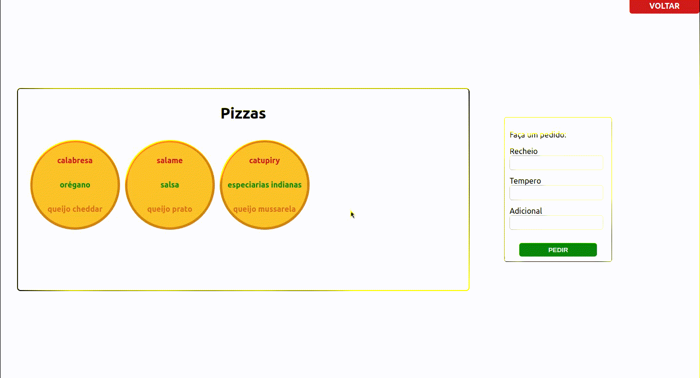

# Pizzaria States React
## Um exemplo prático de props e states no React

### Páginas e Componentes:

**Páginas:**
- Home
- Prateleira

**Componentes:**
- PizzasList
- Pizza
- AddPizzaForm

### Sobre o projeto:

A página **<Home/>** consiste em um título e um **<Link/>** para a página **<Prateleira/>**.

A página **<Prateleira/>** possui um **<Link/>** para voltar para **<Home/>** e, também, os componentes **<PizzasList/>** e **<AddPizzaForm/>**.

**<PizzasList/>** consiste em uma ```<div>``` com um ```map``` para gerar as pizzas, usando o componente **<Pizza/>**, utilizando as props **ingredientes** passadas pelo componente pai: **<Prateleira/>**.

O componente **<Pizza/>** utiliza as props que recebe de **<PizzasList/>** para montar uma pizza com recheio, tempero e adicional.

O componente **<AddPizzaForm/>** possui um formulário, que possibilita o usuário a digitar os ingredientes que quer em sua pizza, e, utilizando do estado do componente, a pizza é montada e exibida na **lista de pizzas** do componente **<Prateleira/>**.
A função **handleClick** é um ponto chave que possibilita essa funcionalidade. Ela é uma callback no componente **<Prateleira/>** e viabiliza passar o **estado** de **componente filho para componente pai**.


